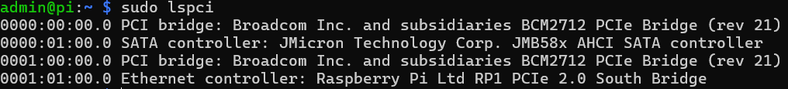
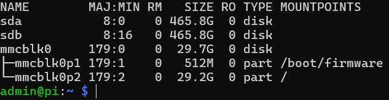

Hello dear fellas and welcome to my very first public github repository.
I'm an aerospace engineer from Germany and would like to share and improve some of my home projects. 

This projects is for everyone who is out-of-cash, but wants to have an own home server.
This project aims to create a all-in-one home server for all my needs:
1) Self-hosted NAS with 2 SSDs (Geekworm X1007 PCIe Pi5 hat)
2) Process and analyze data (e.g. finances from .csv files)
3) Grafana Server: dashboard to visualize data 
4) Show some of Pi's data on a small OLED screen
5) ...

This git repository shall be a reference guide to set everything up, learn how to use git properly, get better in programming and understanding Linux, the Pi and microcontroller, get new insights from others and expand the home server by new features and so on.

The Home Server has a custom made case (3D-printed), the above mentioned SSD-hat, a small 40x40 fan and an I2C OLED Display. 
You can find my Raspberry Pi5 Home Server case with further information here:

## Needed parts

## Software

### OS
Firstly the Operating System needs to be loaded onto an SD-Card. 
The OS is the RASPBERRY PI OS **LITE** (64-BIT), with set username, password and enabled ssh! Do not set up any WiFi.

After installing, put the SD card into the Raspberry Pi and connect the SATA cable on the board, which connects the Pi with the SATA hat.

### NAS
#### Enable PCIe
First we need to edit the Pi's config.txt to enable the PCIe port. 
``
sudo nano /boot/firmware/config.txt
``


Navigate to the bottom and add these lines beneath [all].
```
# Enable the PCIe external connector
dtparam=pciex1
dtparam=pciex1_gen=3
```
Save and exit. (CTRL+X -> Y -> *Enter*)


Reboot the Pi and connect again.
``
sudo reboot
``


Display your PCIe devices and make sure that the SATA Controller is listed.
``
sudo lspci
``

 


#### Mount the drives
To mount the drives, we firstly need to delete possible mounts and partitions on the drives. In the following you need to change ?? and ? with your respective partition name like *sda1* and *sda*.

Use *lsblk* to see if there are any mountpoints or partitions. If so, use the following code snippet:
``
sudo umount /dev/sd??; sudo wipefs --all --force /dev/sd??; sudo wipefs --all --force /dev/sd?
``

Reboot and use *lsblk* - there is no mountpoint nor partition:
```
sudo reboot
--- ssh ---
lsblk
```

 


```
sudo apt update
sudo apt install -y gdisk
sudo sgdisk -n 1:0:0 /dev/sda
sudo sgdisk -n 1:0:0 /dev/sdb
lsblk
sudo reboot
--- ssh ---
sudo apt update
sudo apt install -y mdadm
```

